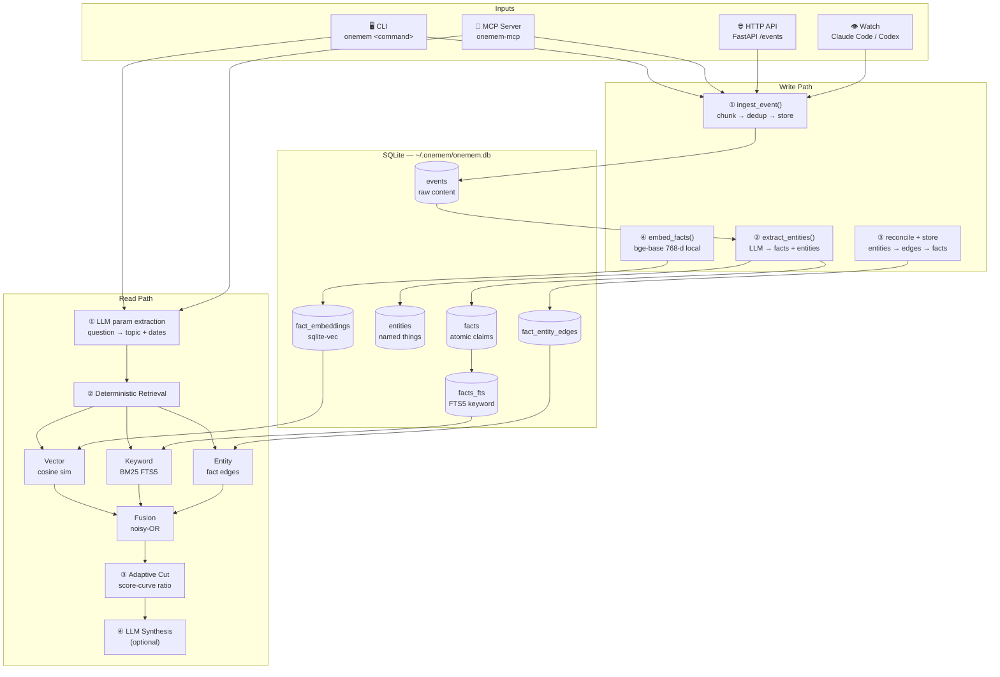
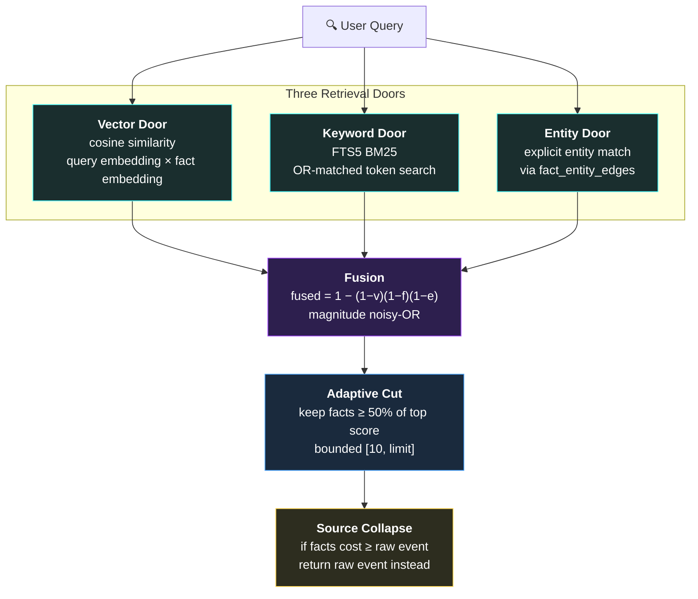

<div align="center">


# oneMEM

### One memory. Every AI. You own it.

Local, structured memory for AI agents — in one SQLite file on your machine.

[](https://pypi.org/project/onemem/)
[](https://pypi.org/project/onemem/)
[](LICENSE)
[](https://pypi.org/project/onemem/)
[](https://github.com/shashank-tomar0/onemem)
[](https://modelcontextprotocol.io)
[](https://docs.anthropic.com/en/docs/claude-code)

<br />

**oneMEM** gives AI tools a shared local memory. It distills useful context into
compact atomic facts and surfaces the **minimum amount of memory sufficient for a
query**. Every connected agent reads and writes the same SQLite file.

```text
AI agents ───┐
Code editors ┼── MCP ── oneMEM ── ~/.onemem/onemem.db
Local tools ─┘
```

</div>

---

## ✨ Why oneMEM?

| | What makes it different |
|---|---|
| 🔒 **Local & private** | One SQLite file on your machine. No server, no cloud, no account. Back it up by copying a file. |
| 🧠 **Deterministic retrieval** | No LLM in the read path. Same query → same result, always. Every ranking decision is inspectable with SQL. |
| 🔗 **Append-only** | Raw events are never overwritten. Facts are only ever added. Corrections mean new events, never mutations. |
| 🤖 **MCP-native** | Exactly two tools (`onemem_recall` + `onemem_log`) — minimal surface for AI agents. Works with Claude Code, Codex, Cursor, Windsurf. |
| 🌐 **BYOLLM** | Bring your own key. Works with OpenRouter, OpenAI, Anthropic, Gemini, Groq, xAI, Hugging Face, Ollama, or any OpenAI-compatible endpoint. |
| ⚡ **Local embeddings** | `bge-base-en-v1.5` (768-d) runs locally. No embedding API, no extra key, no latency. |

---

## 🚀 Quick Start

### Install

Requires **Python 3.11+** and an API key for any supported LLM provider. Embeddings run locally — no extra setup.

```bash
uv tool install "onemem[all]"
```

### Setup

```bash
onemem init
```

`onemem init` walks you through everything:

| Step | What happens |
|:----:|---|
| **1** | Choose your LLM provider + API key + model |
| **2** | Health check: SQLite, sqlite-vec, LLM connectivity |
| **3** | Install background capture (Claude Code / Codex sessions) |
| **4** | Wire MCP into detected AI tools |

### Try it

```bash
# Add something to memory
onemem add "Chose SQLite because it needs zero operations and one-file backups."

# Ask about it later
onemem ask "What storage did I choose, and why?"
```

---

## 📐 Architecture



---

## 🔄 User Flow

```mermaid
flowchart LR
    START([User has a thought])

    subgraph WRITE["✍️ Write"]
        ADD["onemem add<br/>'note'"]
        IMPORT["onemem import<br/>./docs/"]
        WATCH2["onemem watch<br/>(background)"]
        MCP_LOG["onemem_log<br/>(invisible)"]
    end

    subgraph PROCESS["⚙️ Process"]
        LLM_EXTRACT["LLM distills<br/>facts + entities"]
        LOCAL_EMBED["Local embedding<br/>768-d vectors"]
    end

    subgraph STORE["📦 Store"]
        SQLITE[("SQLite<br/>events → facts<br/>→ embeddings")]
    end

    subgraph READ["📖 Read"]
        ASK["onemem ask<br/>'question'"]
        MCP_RECALL["onemem_recall<br/>(AI agent)"]
        SQL["onemem sql<br/>'SELECT...'"]
    end

    START --> WRITE
    WRITE --> PROCESS
    PROCESS --> STORE
    STORE --> READ
    READ --> ANSWER([User gets answer])

    style WRITE fill:#1a2e1a,stroke:#4dff88,color:#fff
    style PROCESS fill:#1a2e1a,stroke:#4dff88,color:#fff
    style STORE fill:#2d2d1f,stroke:#ffd64d,color:#fff
    style READ fill:#1a2a3d,stroke:#4da6ff,color:#fff
```



---

## ⚡ All Commands — Visual Reference

<div align="center">


</div>

---

## 📋 Command Reference

### Core Commands

| Command | What it does | Path |
|---|---|---|
| `onemem init` | Interactive setup wizard (provider, key, model, capture, MCP) | write |
| `onemem add "text"` | Store a note or observation directly | write |
| `onemem ask "question"` | Retrieve matching facts + optional LLM synthesis | read |
| `onemem import <path>` | Bulk-import `.txt` / `.md` files (parallel batch) | write |
| `onemem process` | Process all pending events (extract facts) | write |
| `onemem watch` | Capture Claude Code / Codex sessions in real-time | write |
| `onemem watch --start` | Start background capture service | write |
| `onemem watch --stop` | Stop background capture service | write |

### Inspection Commands

| Command | What it does |
|---|---|
| `onemem status` | Event / fact / entity counts + staleness detection |
| `onemem doctor` | Full health check (DB, sqlite-vec, LLM, write path) |
| `onemem list events` | Browse events with `--since`, `--until`, `--source`, `--limit` |
| `onemem show event N` | Full event detail with extraction provenance |
| `onemem sql "SELECT..."` | Read-only SQL query against the memory |
| `onemem tables` | List all DB tables with row counts |

### Configuration Commands

| Command | What it does |
|---|---|
| `onemem config set` | Interactively change provider, API key, and model |
| `onemem config show` | Show active config safely (never exposes full API key) |

### MCP Tools (for AI agents)

| Tool | Purpose |
|---|---|
| `onemem_recall` | **The ONE read entry passpoint** — topic search, time window, session reconstruction, or raw source lookup |
| `onemem_log` | **Invisible background write** — silently logs conversations. No announcement, no permission, no waiting. |

---

## 🔌 MCP Setup

oneMEM works with **any MCP client** that supports local `stdio` servers.

```bash
# Claude Code (recommended)
claude mcp add --scope user onemem -- "$(command -v onemem-mcp)"

# Codex
codex mcp add onemem -- "$(command -v onemem-mcp)"

# Any other MCP client
# command: onemem-mcp
```

`onemem init` automatically detects and wires Claude Code and Codex during setup.

---

## 🗂️ Where Data Lives

| Path | Contents |
|---|---|
| `~/.onemem/onemem.db` | Events, facts, entities, embeddings (one SQLite file — **back this up**) |
| `~/.onemem/config.toml` | Active provider, model, and runtime settings |
| `~/.onemem/.env` | Provider API keys (only the active provider's key is read) |

---

## 🔬 How Retrieval Works



**Key properties:**
- **No LLM in the read path** — retrieval is a fixed formula, always deterministic
- **Adaptive cut** — sharp queries return tight sets; broad queries return more
- **Source collapse** — when distilled facts don't save tokens, the raw event is returned

---

## 📊 Benchmarks

Measured on a 100-instance stratified sample of [LongMemEval-S](https://arxiv.org/abs/2410.10813):

| Metric | Result |
|---|---:|
| Retrieval recall | **0.89** |
| Context reduction | **99.1%** |
| End-to-end answer accuracy | **72%** |

---

## 🏗️ Supported Providers

| Provider | Key Env Var | Notes |
|---|---|---|
| [OpenRouter](https://openrouter.ai) | `OPENROUTER_API_KEY` | One key, hundreds of models |
| [OpenAI](https://openai.com) | `OPENAI_API_KEY` | Direct GPT access |
| [Anthropic](https://anthropic.com) | `ANTHROPIC_API_KEY` | Native Claude API |
| [Google Gemini](https://ai.google.dev) | `GEMINI_API_KEY` | Direct Gemini access |
| [Groq](https://groq.com) | `GROQ_API_KEY` | Fast inference, open-weight models |
| [xAI](https://x.ai) | `XAI_API_KEY` | Grok access |
| [Hugging Face](https://huggingface.co) | `HF_TOKEN` | Open-weight models via Inference Providers |
| [Ollama](https://ollama.com) | *no key needed* | Free, runs locally |
| Custom | `base_url` + `api_key_env` | Any OpenAI-compatible endpoint |

Embeddings always use **`bge-base-en-v1.5`** (768-d) running locally. No API key needed.

---

## ⚙️ Configuration

Edit `~/.onemem/config.toml` (or use `onemem config set`):

```toml
[model]
provider = "openrouter"    # see provider table above
model = "google/gemini-3.5-flash-lite"

# Only for provider = "custom":
# base_url = "https://vendor.example/v1"
# api_key_env = "MY_VENDOR_API_KEY"

[spend]
max_run_cost_usd = 20.0    # hard ceiling per batch import

[retrieval]
default_limit = 30         # max facts returned per recall
neighbour_max = 20         # neighbour facts gathered around a match

[ingestion]
concurrency = 20           # parallel LLM workers during bulk import
```

---

## 🛠️ Development

```bash
# Clone
git clone https://github.com/shashank-tomar0/onemem.git
cd onemem

# Install with all extras
uv sync --all-extras

# Run tests (144 passing)
uv run pytest -q

# Run with dev home (isolated from your real memory)
./scripts/dev-onemem doctor
```

---

## 📁 Project Structure

```
onemem/
├── cli/              # Click CLI (init, add, ask, watch, ...)
├── api/              # FastAPI HTTP API
├── providers/        # LLM + embedding implementations
│   ├── openai_compat.py    # OpenAI-compatible endpoints
│   ├── anthropic.py        # Anthropic native API
│   └── local_embedding.py  # bge-base-en-v1.5
├── mcp_server.py     # MCP server (onemem_recall + onemem_log)
├── fact_retrieval.py # Deterministic hybrid search
├── pipeline.py       # Ingest + process orchestration
├── entity_extractor.py  # LLM-based entity + fact extraction
├── schema.sql        # SQLite schema
└── config.py         # All tunable settings
```

---

## 📜 License

MIT — Based on [Meniscus](https://github.com/magic-bubblez/meniscus) by magic_bubblez.

---

<div align="center">

**oneMEM** — Your memory, your machine, your AI.

[Get Started →](#-quick-start) · [Report Bug](https://github.com/shashank-tomar0/onemem/issues) · [View Design](DESIGN.md) · [PyPI](https://pypi.org/project/onemem/)

</div>
