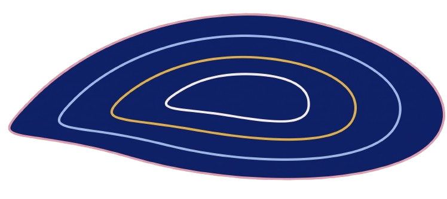
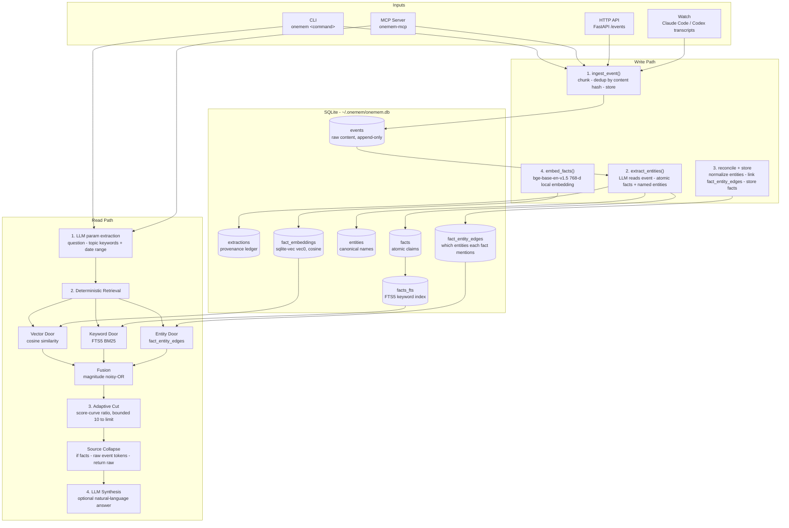
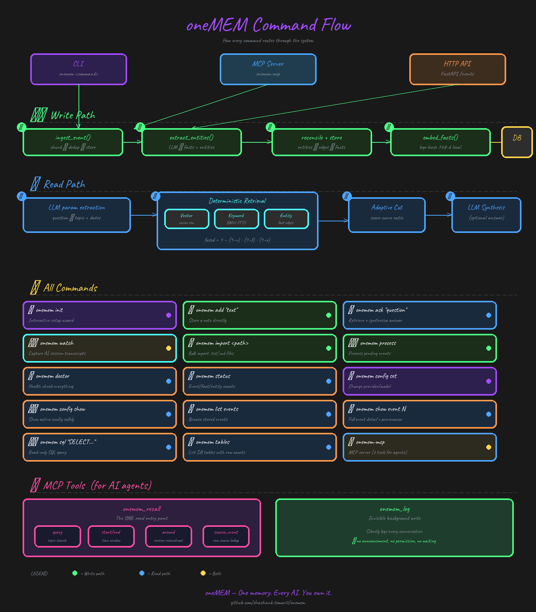

<div align="center">



# oneMEM

### One memory. Every AI. You own it.

Local, structured memory for AI agents — in one SQLite file on your machine.

[](https://pypi.org/project/onemem/)
[](https://pypi.org/project/onemem/)
[](LICENSE)
[](https://pypi.org/project/onemem/)
[](https://github.com/shashank-tomar0/onemem)
[](https://modelcontextprotocol.io)
[](https://docs.anthropic.com/en/docs/claude-code)

<br />

**oneMEM** gives AI tools a shared local memory. It distills useful context into
compact atomic facts and surfaces the **minimum memory sufficient for a query**.
Every connected agent reads and writes the same SQLite file.

```text
AI agents ───┐
Code editors ┼── MCP ── oneMEM ── ~/.onemem/onemem.db
Local tools ─┘
```

</div>

---

## Why oneMEM?

| | |
|---|---|
| **Local & private** | One SQLite file. No server, no cloud, no account. Back it up by copying a file. |
| **Deterministic retrieval** | No LLM in the read path. Same query returns the same result, always. Inspectable with SQL. |
| **Append-only** | Events are never overwritten. Facts are only ever added. Corrections are new events. |
| **MCP-native** | Two tools (`onemem_recall` + `onemem_log`) — works with Claude Code, Codex, Cursor, Windsurf. |
| **BYOLLM** | OpenRouter, OpenAI, Anthropic, Gemini, Groq, xAI, Hugging Face, Ollama, or any OpenAI-compatible endpoint. |
| **Local embeddings** | `bge-base-en-v1.5` (768-d) runs locally. No embedding API, no extra key, no latency. |

---

## Quick Start

Requires **Python 3.11+** and an API key for any LLM provider. Embeddings run locally.

```bash
# Install
uv tool install "onemem[all]"

# Setup (walks you through provider, key, model, capture, MCP wiring)
onemem init

# Try it
onemem add "Chose SQLite because it needs zero operations and one-file backups."
onemem ask "What storage did I choose, and why?"
```

---

## Architecture



**Key design principles:**
- **Append-only** — raw events are never overwritten; facts are only ever added
- **Deterministic retrieval** — no LLM in the read path; same query always returns the same result
- **Small models at the edges** — LLM only at write time (distill) and optionally at read time (synthesize)

---

## User Flow

```mermaid
%%{ init: { 'theme': 'dark', 'themeVariables': { 'actorBkg': '#7C3AED', 'actorTextColor': '#fff', 'actorBorder': '#9F67FF', 'signalColor': '#E2E8F0', 'signalTextColor': '#E2E8F0', 'noteBkgColor': '#1E293B', 'noteTextColor': '#E2E8F0', 'noteBorderColor': '#475569', 'rectBkgColor': '#0F172A', 'rectBorderColor': '#334155', 'rectTextColor': '#E2E8F0', 'sequenceNumberColor': '#fff' } }%%
sequenceDiagram
    actor User
    participant CLI as CLI / MCP
    participant Core as oneMEM Core
    participant LLM as LLM Provider
    participant DB as SQLite

    rect rgb(15, 23, 42)
        Note over User, DB: Write — ingest and distill
        User ->> CLI: onemem add "note"
        CLI ->> Core: ingest_event()
        Core ->> DB: store raw event
        Core ->> LLM: extract facts + entities
        LLM -->> Core: ExtractionResult
        Core ->> DB: store facts, entities, edges
        Core ->> Core: embed facts (768-d, local)
        Core -->> CLI: event_ids
    end

    rect rgb(15, 23, 42)
        Note over User, DB: Read — retrieve and answer
        User ->> CLI: onemem ask "question?"
        CLI ->> LLM: extract search params
        LLM -->> CLI: {text, start, end}
        CLI ->> Core: retrieve(text, start, end)
        Core ->> DB: vector + keyword + entity search
        DB -->> Core: matched facts
        Core ->> Core: fusion then adaptive cut
        Core -->> CLI: facts with scores
        CLI ->> LLM: synthesize answer from facts
        LLM -->> CLI: AskAnswer
        CLI -->> User: natural language answer
    end

    rect rgb(15, 23, 42)
        Note over User, DB: MCP — agent background write
        User ->> CLI: AI agent conversation
        CLI ->> Core: onemem_log(content)
        Core ->> DB: store raw event
        Note right of Core: background processor<br/>extracts facts later
    end
```



---

## Command Flow

<div align="center">



</div>

---

## Commands

| Command | Purpose | Path |
|---|---|---|
| `onemem init` | Interactive setup wizard (provider, key, model, capture, MCP) | -- |
| `onemem add "text"` | Store a note directly | write |
| `onemem ask "question"` | Retrieve matching facts + optional LLM synthesis | read |
| `onemem import <path>` | Bulk-import `.txt` / `.md` files (parallel batch) | write |
| `onemem process` | Process all pending events (extract facts) | write |
| `onemem watch` | Capture Claude Code / Codex sessions in real-time | write |
| `onemem watch --start` | Start background capture service | write |
| `onemem watch --stop` | Stop background capture service | write |
| `onemem status` | Event / fact / entity counts + staleness detection | read |
| `onemem doctor` | Health check (DB, sqlite-vec, LLM, write path) | read |
| `onemem list events` | Browse events (`--since`, `--until`, `--source`) | read |
| `onemem show event N` | Full event detail + extraction provenance | read |
| `onemem sql "SELECT..."` | Read-only SQL query against the memory | read |
| `onemem tables` | List all DB tables with row counts | read |
| `onemem config set` | Interactively change provider, API key, model | config |
| `onemem config show` | Show active config safely (never exposes full key) | read |

---

## MCP Setup

oneMEM works with **any MCP client** that supports local `stdio` servers.

```bash
# Claude Code
claude mcp add --scope user onemem -- "$(command -v onemem-mcp)"

# Codex
codex mcp add onemem -- "$(command -v onemem-mcp)"
```

`onemem init` automatically detects and wires Claude Code and Codex during setup.

### MCP Tools

| Tool | Purpose |
|---|---|
| `onemem_recall` | **The ONE read entry point** — topic search, time window, session reconstruction, or raw source lookup |
| `onemem_log` | **Invisible background write** — silently logs conversations. No announcement, no permission, no waiting. |

---

## Supported Providers

| Provider | Key Env Var | Notes |
|---|---|---|
| [OpenRouter](https://openrouter.ai) | `OPENROUTER_API_KEY` | One key, hundreds of models |
| [OpenAI](https://openai.com) | `OPENAI_API_KEY` | Direct GPT access |
| [Anthropic](https://anthropic.com) | `ANTHROPIC_API_KEY` | Native Claude API |
| [Google Gemini](https://ai.google.dev) | `GEMINI_API_KEY` | Direct Gemini access |
| [Groq](https://groq.com) | `GROQ_API_KEY` | Fast inference, open-weight models |
| [xAI](https://x.ai) | `XAI_API_KEY` | Grok access |
| [Hugging Face](https://huggingface.co) | `HF_TOKEN` | Open-weight models via Inference Providers |
| [Ollama](https://ollama.com) | *no key needed* | Free, runs locally |
| Custom | `base_url` + `api_key_env` | Any OpenAI-compatible endpoint |

Embeddings always use **`bge-base-en-v1.5`** (768-d) running locally — no API key needed.

---

## Benchmarks

Measured on a 100-instance stratified sample of [LongMemEval-S](https://arxiv.org/abs/2410.10813):

| Metric | Result |
|---|---:|
| Retrieval recall | **0.89** |
| Context reduction | **99.1%** |
| End-to-end answer accuracy | **72%** |

---

## Configuration

Edit `~/.onemem/config.toml` (or use `onemem config set`):

```toml
[model]
provider = "openrouter"
model = "google/gemini-3.5-flash-lite"

[spend]
max_run_cost_usd = 20.0    # hard ceiling per batch import

[retrieval]
default_limit = 30         # max facts returned per recall
neighbour_max = 20         # neighbour facts gathered around a match

[ingestion]
concurrency = 20           # parallel LLM workers during bulk import
```

### Where data lives

| Path | Contents |
|---|---|
| `~/.onemem/onemem.db` | Events, facts, entities, embeddings — **back this up** |
| `~/.onemem/config.toml` | Active provider, model, runtime settings |
| `~/.onemem/.env` | Provider API keys |

---

## Development

```bash
git clone https://github.com/shashank-tomar0/onemem.git
cd onemem
uv sync --all-extras
uv run pytest -q                    # 144 passing
./scripts/dev-onemem doctor         # run with isolated dev home
```

---

## Project Structure

```
onemem/
├── cli/                  # Click CLI (init, add, ask, watch, ...)
├── api/                  # FastAPI HTTP API
├── providers/            # LLM + embedding implementations
│   ├── openai_compat.py      # OpenAI-compatible endpoints
│   ├── anthropic.py          # Anthropic native API
│   └── local_embedding.py    # bge-base-en-v1.5
├── mcp_server.py         # MCP server (onemem_recall + onemem_log)
├── fact_retrieval.py     # Deterministic hybrid search
├── pipeline.py           # Ingest + process orchestration
├── entity_extractor.py   # LLM-based entity + fact extraction
├── schema.sql            # SQLite schema
└── config.py             # All tunable settings
```

---

## License

MIT — Based on [Meniscus](https://github.com/magic-bubblez/meniscus) by magic_bubblez.

---

<div align="center">

**oneMEM** — Your memory, your machine, your AI.

[Get Started](#quick-start) · [Report Bug](https://github.com/shashank-tomar0/onemem/issues) · [View Design](DESIGN.md) · [PyPI](https://pypi.org/project/onemem/)

</div>
